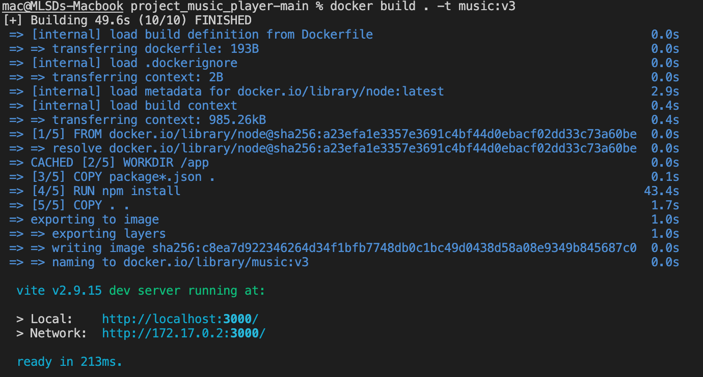

# Build and Deploy a Better Spotify 2.0 Clone Music App with React 18! (Tailwind, Shazam, Redux)

<h1>MUSIC WEBSITE</h1>
<h2>1. Các bước chạy và cài đặt Docker trên hệ điều hành Ubuntu</h2>
Bước 1: Cập nhật hệ thống
Tiến hành cập nhật các gói (package) đã được cài đặt trên hệ thống Ubuntu bằng lệnh:

sudo apt update -y && apt upgrade -y
    
Bước 2: Cài đặt Docker
Để cài đặt bản Docker mới nhất, các  nên cài đặt trực tiếp từ kho lưu trữ của Docker.

Cài đặt một số gói cho phép sử dụng HTTPS.
  
sudo apt install apt-transport-https ca-certificates curl software-properties-common
    
Thêm khóa GPG của kho lưu trữ Docker.
  
curl -fsSL https://download.docker.com/linux/ubuntu/gpg | sudo gpg --dearmor -o /usr/share/keyrings/docker-archive-keyring.gpg
    
Bây giờ hãy thêm kho lưu trữ Docker của Ubuntu 22.04 ( jammy) vào các apt sources.
  
echo "deb [arch=$(dpkg --print-architecture) signed-by=/usr/share/keyrings/docker-archive-keyring.gpg] https://download.docker.com/linux/ubuntu $(lsb_release -cs) stable" | sudo tee /etc/apt/sources.list.d/docker.list > /dev/null
    
Cập nhật packages và thiết lập để cài đặt Docker từ kho lưu trữ chính thức.
  
sudo apt update
sudo apt-cache policy docker-ce
    
    
Cài đặt Docker
  
sudo apt install docker-ce -y
 
    
Kiểm tra trạng thái của Docker
 
sudo systemctl status docker

    
Bước 3: Cấu hình quyền Sudo cho user sử dụng Docker
Các Docker yêu cầu chỉ được thực thi với tư cách người dùng root theo mặc định. Do đó nếu các  sử dụng các user khác thì cần phải thêm user đó vào nhóm Docker thì mới có quyền thao tác.

sudo usermod -aG docker username  (Nhớ thay username bằng user của )
    
Bước 4: Sử dụng lệnh Docker để build container
Để xem các thông tin về Docker

docker info

    
Build Docker image
  
docker build . -t <tên tag image>

Để xem các image đã build

docker image ls

Để chạy image đã build 

docker run -itd -p <Cổng của dự án expose ra>:<cổng ánh xạ đến container> <name:tag>

Để check container đang chạy 

docker ps

Để kiểm tra logs trong quá trình chạy container 

docker logs <image ID>

<h2>2. Cài đặt và triển khai CI/CD</h2>