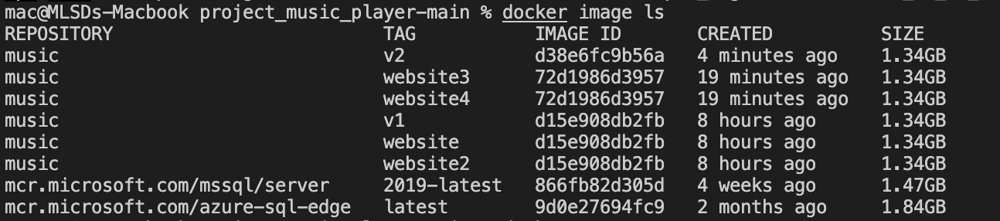
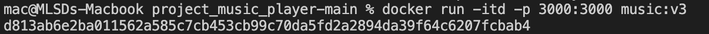
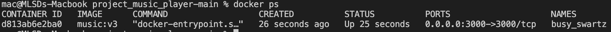
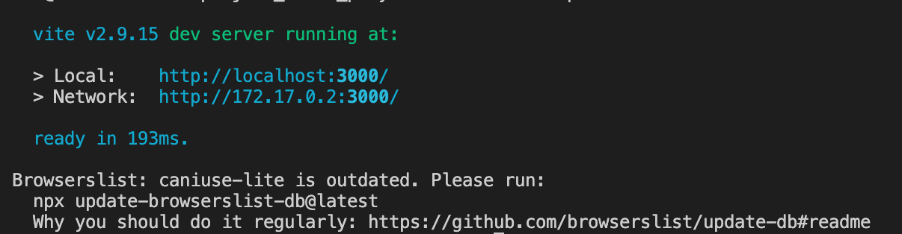

# Build and Deploy a Better Spotify 2.0 Clone Music App with React 18! (Tailwind, Shazam, Redux)

<h1>MUSIC WEBSITE</h1>
<h2>1. Các bước chạy và cài đặt Docker trên hệ điều hành Ubuntu</h2>
<h3>Bước 1: Cập nhật hệ thống</h3>
Tiến hành cập nhật các gói (package) đã được cài đặt trên hệ thống Ubuntu bằng lệnh:

<h4>sudo apt update -y && apt upgrade -y</h4>
    
<h3>Bước 2: Cài đặt Docker</h3>
Để cài đặt bản Docker mới nhất, các  nên cài đặt trực tiếp từ kho lưu trữ của Docker.

Cài đặt một số gói cho phép sử dụng HTTPS.

<h4>sudo apt install apt-transport-https ca-certificates curl software-properties-common</h4>  
    
Thêm khóa GPG của kho lưu trữ Docker.
  
<h4>curl -fsSL https://download.docker.com/linux/ubuntu/gpg | sudo gpg --dearmor -o /usr/share/keyrings/docker-archive-keyring.gpg</h4>
    
Bây giờ hãy thêm kho lưu trữ Docker của Ubuntu 22.04 ( jammy) vào các apt sources.
  
<h4>echo "deb [arch=$(dpkg --print-architecture) signed-by=/usr/share/keyrings/docker-archive-keyring.gpg] https://download.docker.com/linux/ubuntu $(lsb_release -cs) stable" | sudo tee /etc/apt/sources.list.d/docker.list > /dev/null</h4>
    
Cập nhật packages và thiết lập để cài đặt Docker từ kho lưu trữ chính thức.
  
<h4>sudo apt update</h4>
<h4>sudo apt-cache policy docker-ce</h4>
    
    
Cài đặt Docker
  
<h4>sudo apt install docker-ce -y</h4>

 
    
Kiểm tra trạng thái của Docker
 
<h4>sudo systemctl status docker</h4>

    
<h3>Bước 3: Cấu hình quyền Sudo cho user sử dụng Docker</h3>
Các Docker yêu cầu chỉ được thực thi với tư cách người dùng root theo mặc định. Do đó nếu các  sử dụng các user khác thì cần phải thêm user đó vào nhóm Docker thì mới có quyền thao tác.

<h4>sudo usermod -aG docker username  (Nhớ thay username bằng user của )</h4>
    
<h3>Bước 4: Sử dụng lệnh Docker để build container</h3>
Để xem các thông tin về Docker

<h4>docker info</h4>

    
Build Docker image
  
<h4>docker build . -t [tên tag image] </h4>

Để xem các image đã build

<h4>docker image ls</h4>

Để chạy image đã build 

<h4>docker run -itd -p [Cổng của dự án expose ra]:[cổng ánh xạ đến container] [name:tag] </h4>

Để check container đang chạy 

<h4>docker ps</h4>

Để kiểm tra logs trong quá trình chạy container 

<h4>docker logs <image ID></h4>

<h2>2. Phân chia công việc</h2>

1. Trần Quang Thắng
2. Nguyễn Việt Hòa
3. Vũ Đức Duy
4. Bùi Trung Kiên
5. Trần Văn Tài

<h2>2. Cài đặt và triển khai CI/CD sử dụng jenkin và docker</h2>